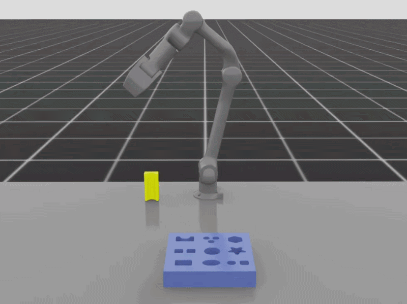
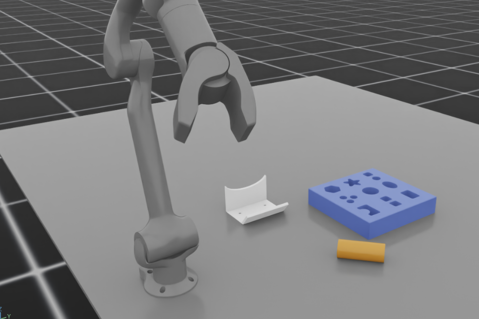

# FMB-IsaacLab

Isaac Lab simulation environments replicating the peg-in-hole assembly setting from the [Functional Manipulation Benchmark (FMB)](https://github.com/rail-berkeley/fmb).

> Note
> This public version has been tested inside the [stable-baselines3-devkit](https://github.com/iit-DLSLab/stable-baselines3-devkit) framework.



## Overview

This repository packages the simulation-facing pieces needed to run the FMB-style assembly task in Isaac Lab:

- sim-ready USD assets for the board, pegs, fixture, and table
- single-shape, hard, and random-shape assembly environment configs
- asset generation and physics patching scripts for reproducibility
- task MDP terms used by the assembly environments

The current public snapshot focuses on the environment and asset side of the benchmark replication.



## Repository Layout

```text
<src>/
├── assets/
│   └── fmb_isaac/
│       ├── usd/
│       └── scripts/
└── configs/
    └── tasks/
        ├── assembly_env_cfg_kinova.py
        ├── assembly_env_cfg_z1.py
        └── envs/
            ├── assembly_env.py
            ├── hard_assembly_env.py
            ├── random_assembly_env.py
            └── assembly_mdp/
```

## Included

- `assets/fmb_isaac/usd/`: runtime USD assets used by the assembly tasks
- `assets/fmb_isaac/scripts/`: regeneration and collision/physics patch utilities
- `configs/tasks/assembly_env_cfg_kinova.py`: Kinova assembly task configs
- `configs/tasks/assembly_env_cfg_z1.py`: Unitree Z1 assembly task configs
- `configs/tasks/envs/`: base scene definitions and task variants
- `configs/tasks/envs/assembly_mdp/`: observations, rewards, and terminations

## Notes

- This repo is a simulation environment replication of FMB, not a copy of the full original benchmark codebase.
- The exported config files still depend on external Isaac Lab modules and robot asset/config packages that are not bundled here.
- Thanks to the [ARCH repository](https://github.com/Jiankai-Sun/ARCH), which helped inform the assembly-task setup and public release direction.
